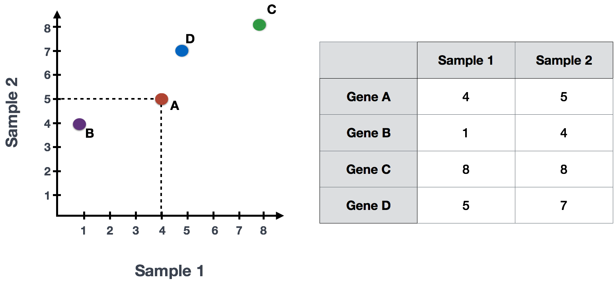
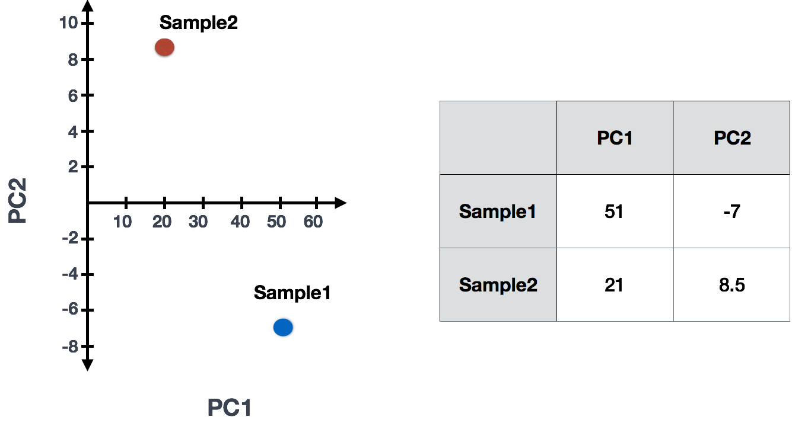

#### Principal Component Analysis (PCA)

Principal Component Analysis (PCA) is a technique used to emphasize variation and bring out strong patterns in a dataset (dimensionality reduction). Details regarding PCA are given below (based on [materials from StatQuest](https://www.youtube.com/watch?v=_UVHneBUBW0), and if you would like a more thorough description, we encourage you to explore [StatQuest's video](https://www.youtube.com/watch?v=_UVHneBUBW0). 

If you had two samples and wanted to plot the counts of one sample versus another, you could plot the counts of one sample on the x-axis and the other sample on the y-axis as shown below:

{ width=600px }

You could draw a line through the data in the direction representing the most variation, which is on the diagonal in this example. The maximum variation in the data is between the two endpoints of this line.  

We also see the genes vary somewhat above and below the line. We could draw another line through the data representing the second most amount of variation in the data. 

{ width=600px }

The genes near the ends of the line, which would include those genes with the highest variation between samples (high expression in one sample and low expression in the other), have the greatest influence on the direction of the line. 

{ width=600px }

For example, a small change in the value of *Gene C* would greatly change the direction of the line, whereas a small change in *Gene A* or *Gene D* would have little affect.

{ width=900px }

We could just rotate the entire plot and view the lines representing the variation as left-to-right and up-and-down. We see most of the variation in the data is left-to-right; this is and the second most variation in the data is up-and-down. These axes that represent the variation are "Principal Components", with PC1 representing the most variation in the data and PC2 representing the second most variation in the data. 

If we had three samples, then we would have an extra direction in which we could have variation. Therefore, if we have *N* samples we would have *N*-directions of variation or principal components.

{ width=300px }

We could give quantitative scores to genes based on how much they influence PC1 and PC2. Genes with little influence would get scores near zero, while genes with more influence would receive larger scores. Genes on opposite ends of the lines have a large influence, so they would receive large scores, but with opposite signs.

{ width=600px }

To generate a score per sample, we combine the read counts for all genes. To calculate the scores, we do the following:
	
	Sample1 PC1 score = (read count * influence) + ... for all genes
	
Using the counts in the table for each gene (assuming we had only 4 genes total) we could calculate PC1 and PC2 values for each sample as follows:

	Sample1 PC1 score = (4 * -2) + (1 * -10) + (8 * 8) + (5 * 1) = 51
	Sample1 PC2 score = (4 * 0.5) + (1 * 1) + (8 * -5) + (5 * 6) = -7
	
	Sample2 PC1 score = (5 * -2) + (4 * -10) + (8 * 8) + (7 * 1) = 21
	Sample2 PC2 score = (5 * 0.5) + (4 * 1) + (8 * -5) + (7 * 6) = 8.5
	
The scores would then be plotted to examine whether the samples exhibit similar variation across all genes:

{ width=600px }

Since genes with the greatest variation between samples will have the greatest influence on the principal components, we hope our condition of interest explains this variation (e.g. high counts in one condition and low counts in the other). With PC1 representing the most variation in the data and PC2 representing the second most variation in the data, we can visualize how similar the variation of genes is between samples.
